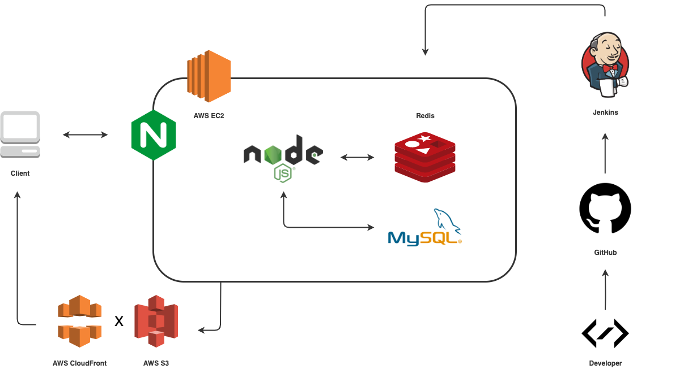

# STYLiSH

STYLiSH, an e-commerce website built with Node/Express, MySQL, Redis and Nginx. Easily to deploy with Docker and Jenkins.

* Website URL
  * http://stylish.jia-boung.com/

## Techniques

### Backend

* Node/Express
* Nginx
* AWS EC2/S3
* Multer
* MySQL
* Redis
* PM2
* Pug

### Front-End

* jQuery
* CSS & HTML

### Development

* ESLint
* Github
* Artillery
* MySQLWorkbench

## Architecture

## Database Schema

